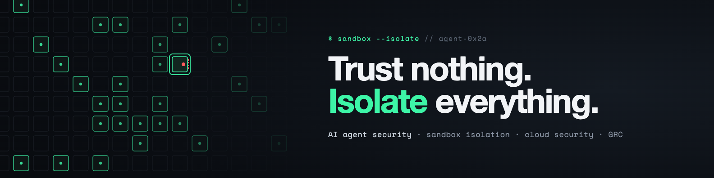

<p align="center">
  
</p>

<p align="center">
  <a href="https://www.linkedin.com/in/ante-projic"></a>
  <a href="https://orcid.org/0009-0009-1673-7270"></a>
  <a href="https://scholar.google.com/citations?user=PCL06PIAAAAJ"></a>
  <a href="https://www.croris.hr/osobe/profil/41396"></a>
</p>

```console
$ whoami
ante — CISO @ daytona · lecturer @ aspira

$ cat focus.txt
AI agent security · sandbox isolation · cloud security
supply-chain & CI/CD hardening · GRC (SOC 2, ISO 27001)

$ history | tail -3
  2010  CISO, regulated Croatian bank
  2017  Hrvatski Telekom → Head of IT Operations & DevOps
  2026  CISO, Daytona
```

I'm Ante. At [Daytona](https://www.daytona.io), AI agents run the code they generate inside isolated sandboxes, and my job is making sure that isolation holds. Before that I spent nine years at Hrvatski Telekom running the systems, after nearly six as CISO for a regulated bank. I also teach cloud computing at Aspira University of Applied Sciences in Split.

**Also built:** I designed and built the [events calendar for ajme.hr](https://ajme.hr/kalendar/), a lifestyle portal covering Split and Dalmatia. It gives readers a daily reason to come back, around 11–20 events a day with a weekly pick, and gives the portal a sponsored-listing format for partners, clearly labelled as such. Under the hood it's a custom WordPress plugin with today, tomorrow and weekend views, a month grid, category filters and an event submission form. Pages are served from cache in about 100 ms instead of 0.7–1.6 s, and each event carries Schema.org data for search. I've run the portal's technical side since April 2026.

**Teaching material** for my courses at Aspira:
- [Cloud-Computing](https://github.com/aprojic/Cloud-Computing): lab environment for the Cloud IT Systems course
- [Information-System-Security](https://github.com/aprojic/Information-System-Security): hands-on offensive and defensive security labs
